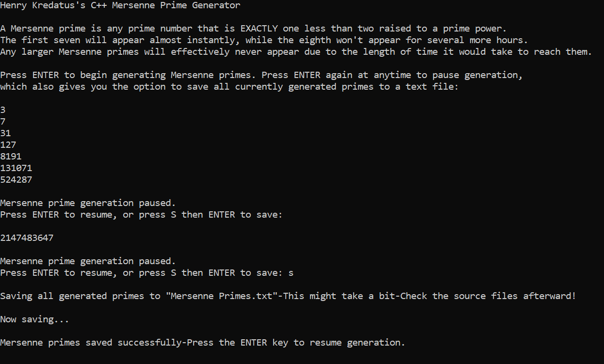

## Mersenne Prime Generator

This program takes all the functionality of the original Prime Number Generator, but instead of printing and storing EVERY prime, it only does so with Mersenne primes.

Mersenne primes are any primes that are equivalent to 2^p-1, where p is a prime exponent that two is being raised to. Or in other words, a Mersenne prime is any prime number that's also EXACTLY one less than two raised to a prime power. Very few are known to exist, and this generator will realistically only ever show you eight. The first seven show up almost immediately after the generator begins, with the eighth (equivalent to the int integer limit) showing up a few hours later. Any larger Mersenne primes would take an obscene amount of time to reach.

The ability to pause and unpause, as well as save all generated primes (Mersenne primes in this case) to an outfile also return from the original.

## CONTROLS

-ENTER (At Start) - Begin Generating

-ENTER (While Running) - Pause Generator

-ENTER (While Paused) - Resume Generator

-S+ENTER - Save All Generated Mersenne Primes to "Mersenne Primes.txt" in the Source Files (ONLY WHILE PAUSED)

## Running

